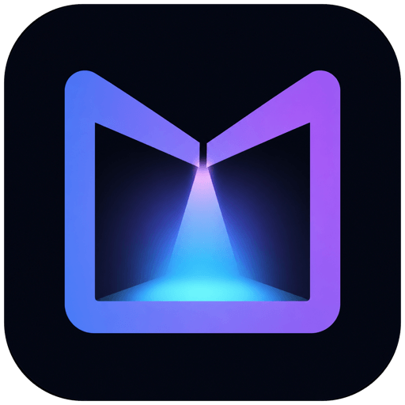

  

<h1 align="center">Muralume</h1>

管理本地视频，随时播放，也让它们成为桌面。

Muralume 是一款面向 macOS 的本地视频库播放器。你可以添加保存视频的文件夹，按原有目录浏览内容，用 Tag 建立自己的分类方式，并把正在播放的一组视频切换为动态桌面。

> Muralume 正在早期开发中，暂未发布可下载版本。下面列出的内容是首个公开版本的目标功能，并不代表当前开发代码已经适合日常使用。

## 首个公开版本计划

- 添加一个或多个本机或外置磁盘文件夹，自动发现其中多层目录下的视频。
- 按原始文件夹层级浏览，或将全部视频汇总为平铺网格。
- 在播放列表中进入编辑状态，管理或移除已添加的文件夹；移除只影响 Muralume 中的内容，不会删除源文件。
- 按名称、文件创建时间或大小排序。
- 按文件名搜索视频。
- 为一个视频添加多个 Tag，支持批量编辑，并按 Tag 快速筛选。
- 从当前文件夹、筛选结果或选中的视频开始播放。
- 支持顺序播放或单轮不重复的随机播放，并可选择播完停止、列表循环或单曲循环；随机列表循环会在每轮结束后重新洗牌。
- 提供播放、暂停、进度跳转、音量、静音、倍速、全屏、上一部和下一部等常用控制；静音会将音量归零，取消静音时恢复之前的音量。
- 保存未看完视频的播放进度。
- 将当前播放队列切换为动态桌面；进入后 Muralume 会从程序坞隐藏，只在菜单栏保留入口，可暂停、播放下一个、调整倍速、切换画面适配方式或返回播放器。
- 支持跟随系统语言，也可以在设置中随时切换简体中文或英文。

## 计划中的动态桌面体验

动态桌面始终静音，但不会覆盖播放器记住的音量与静音状态，返回播放器后会恢复；它也会沿用播放器当前的倍速，你可以随时从菜单栏调整。进入动态桌面后，可以从菜单栏在“填满屏幕”和“完整显示”之间切换，不影响桌面文件和小组件的使用，也不会拦截鼠标或键盘操作。锁屏、显示器休眠或电脑睡眠时会暂停，回到桌面后再按之前的状态恢复。

关闭 Muralume 的主窗口或退出应用会停止当前播放。开启“登录时启动”后，如果上次动态桌面仍具有有效、可访问的播放队列，可以在下次系统登录时恢复。

## 本地与隐私

Muralume 以本地使用为先。视频、文件路径、Tag 和播放记录都保存在你的 Mac 上，不需要账号，也不会上传到云端。应用不会删除、移动或重命名源视频；从媒体库移除文件夹只会清理应用内数据。首个版本也不包含产品遥测或自动崩溃上传。

## 系统与格式

- Apple 芯片 Mac
- macOS 14 或更高版本；实际验证版本以每次 Release 的说明为准
- 首个版本重点支持 MP4、MOV、M4V，以及常见的 H.264、HEVC 视频
- 首个版本暂不支持 Intel Mac、多显示器独立播放、字幕、MKV 和 WebM

实际可播放性也会受到视频内部编码方式影响。

## 获取 Muralume

首个公开版本完成后，将仅通过本仓库的 GitHub Releases 提供下载。

## 开源与品牌

Muralume 的源代码与文档使用 [MIT License](LICENSE) 开源。项目仍处于早期阶段，界面与体验细节可能继续调整。

Muralume 名称、Logo、App Icon 与菜单栏图标不包含在 MIT 授权范围内，具体使用规则见 [品牌资产声明](BRAND_ASSETS.md)。
