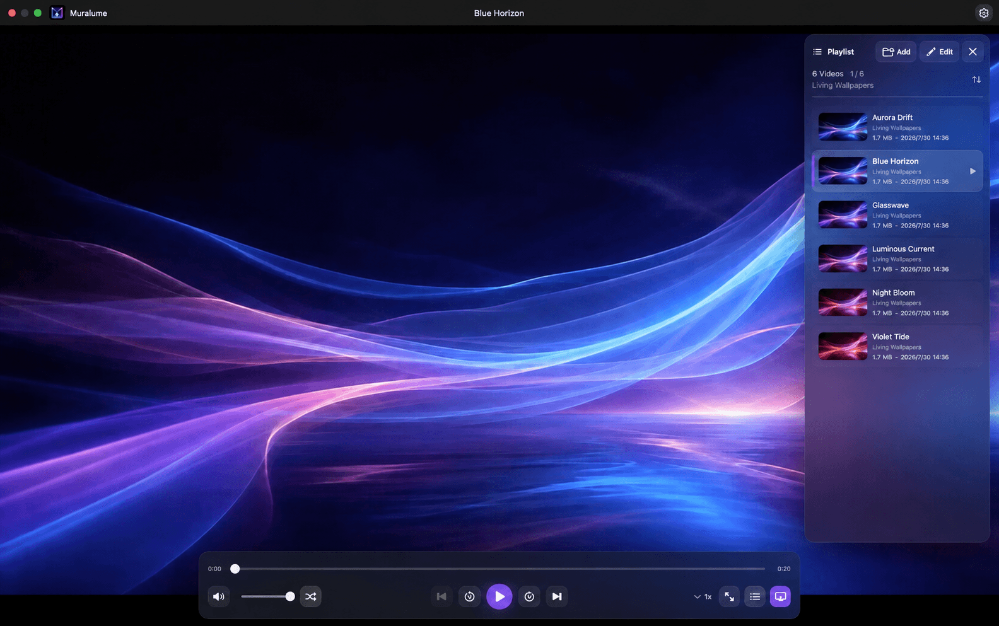

<p align="center">
  
</p>

<h1 align="center">Muralume</h1>

<p align="center"><strong>Your videos. Your Mac. Your desktop in motion.</strong></p>

<p align="center">
  <strong>English</strong> · <a href="README.zh-CN.md">简体中文</a>
</p>

<p align="center">
  <a href="https://github.com/MisakiHCL/Muralume/releases/latest"><strong>Download the latest release</strong></a>
  · Apple silicon · macOS 14+
</p>

<p align="center">
  
</p>

Muralume is a private, native macOS Dynamic Desktop app that turns the videos and folders you choose into a living desktop. A focused local player and playlist keep everything organized—without an account, cloud upload, or tracking.

## Why Muralume

| | |
|---|---|
| **Your videos, not a catalog** | Use pet moments, travel memories, timelapses, or generated clips you already own. |
| **Folders become playlists** | Add individual videos, entire folders, or drop either directly from Finder. |
| **A desktop that stays usable** | Motion sits behind desktop files and widgets without taking over clicks or focus. |
| **Private and native** | Read-only local access, macOS-native playback, no account, uploads, ads, or telemetry. |

## How it works

1. Use the single Add Media picker to build a lasting library from videos, folders, or both, or drop them into Muralume from Finder.
2. Open a supported video from Finder for a temporary viewing session, or play it directly from the library when it is already there.
3. Choose ordered playback, shuffle, or Repeat Current and preview the real upcoming queue in the built-in player.
4. Press `⌘D` to place the same queue behind your files and widgets as a Dynamic Desktop.

## Highlights

### Private by design

Your source videos stay exactly where you put them. Muralume receives read-only access only to the videos or folders you choose and never uploads, moves, renames, or deletes them. There is no account system, product telemetry, or automatic crash reporting.

### An energy-aware Dynamic Desktop

Place the current queue behind desktop files and widgets on every connected display while keeping each desktop fully interactive. Displays can be connected, removed, rearranged, or resized without restarting the queue. Muralume uses macOS-native playback, stays muted in desktop mode, does not prevent display sleep, and pauses automatically when the screen locks, every display sleeps, or the system enters a constrained state.

By default, Muralume keeps the full video sharp and fills any remaining space with a softly blurred version of the same frame.

### Videos and folders become playlists

Use one Add Media picker to choose individual videos, folders from your Mac or an external drive, or both in the same selection; you can also drop the same mix from Finder. Muralume recursively discovers AVFoundation-native MP4, MOV, M4V, MPEG, MPEG-2, MPEG-TS, 3GP, 3G2, AVI, and DV videos in folders, generates local thumbnails, and sorts everything by name, creation date, or file size—without reorganizing anything on disk. If a folder changes in Finder, use **Edit → Refresh Data** in the playlist to rescan the access you already granted.

Unsupported file formats are rejected when you add or open them, with a concise explanation instead of a format list in Settings. Drops onto the video area remain available while Settings is open; accepted files are added without autoplaying behind the panel.

Muralume also appears in Finder’s **Open With** menu for these supported video formats. A file already in the library plays from the library queue; other files open in a temporary queue and are saved only if you explicitly add them. Settings shows whether Muralume is the default player for all, some, or none of these formats and lets you set it explicitly.

### A library and queue with different jobs

The Media Library is your complete, persistent, sortable collection. The Play Queue shows the actual playback sequence, including shuffle order and temporary Finder items. Selecting another library video preserves valid Previous navigation, and refreshing the library reconciles additions and confirmed deletions without discarding the active queue.

Large queues stay responsive: Now Playing is followed by a bounded upcoming window, with more loaded only when requested. The library itself continues to use a native virtualized table for full-collection browsing.

### Focused native playback

Seek, change volume or speed, enter fullscreen, and choose ordered playback, shuffle, or Repeat Current. Shuffle visits every available video once before starting a new round. A one-video queue loops efficiently by seeking the existing player item back to the beginning, while manual Previous and Next remain disabled. Controls stay out of the way while you watch, and global playback preferences return on the next launch.

Quit and reopen Muralume to continue from the same video, position, play or pause state, and presentation. If you were using the Dynamic Desktop, Muralume restores it directly without briefly opening the player window.

### Ready when you log in

Optionally start Muralume with macOS and restore the current queue directly as a Dynamic Desktop. The app keeps the window out of the way and exposes playback controls through its menu bar item.

## Download

[Download `Muralume.dmg`](https://github.com/MisakiHCL/Muralume/releases/latest/download/Muralume.dmg), open it, and drag Muralume into Applications.

The latest release includes a Developer ID–signed and Apple-notarized DMG plus its [SHA-256 checksum](https://github.com/MisakiHCL/Muralume/releases/latest/download/Muralume.dmg.sha256).

> This page documents the current `main` branch. See the [latest release](https://github.com/MisakiHCL/Muralume/releases/latest) for the exact shipped scope.

## Restore after login

To restore the current queue automatically after login, open Settings and enable **Start Dynamic Desktop at Login** while a video queue is active. macOS may ask you to approve Muralume in Login Items.

The menu bar item lets you pause, skip, choose a playback mode, change playback speed or desktop fit, return to the player, and quit Muralume.

## Keyboard shortcuts

| Action | Shortcut |
|---|---|
| Add videos or folders | `⌘O` |
| Set as Dynamic Desktop | `⌘D` |
| Play / pause | `Space` |
| Back / forward 10 seconds | `←` / `→` |
| Previous / next video | `⌘←` / `⌘→` |
| Volume down / up | `↓` / `↑` |
| Mute / unmute | `M` |
| Enter / exit fullscreen | `F` |
| Open settings | `⌘,` |

## System requirements

- Apple silicon Mac
- macOS 14 or later
- AVFoundation-native MP4, MOV, M4V, MPEG, MPEG-2, MPEG-TS, 3GP, 3G2, AVI, or DV video
- All connected displays share the same video, playback clock, and display mode; per-display media is not supported

Playback compatibility depends on the codecs available through macOS AVFoundation. H.264 and HEVC are common compatible choices.

## Build from source

Install Xcode with Swift 6 support and [ripgrep](https://github.com/BurntSushi/ripgrep), then run:

```bash
git clone https://github.com/MisakiHCL/Muralume.git
cd Muralume
make test
make package-macos
```

`make package-macos` creates an ad-hoc signed DMG in `dist/macos-local/` for local installation testing only.

The macOS UI suite needs one-time developer-tool authorization. If XCTest cannot enable automation mode, run `sudo /usr/sbin/DevToolsSecurity -enable`, approve the launcher under **Privacy & Security** if prompted, then rerun `./Scripts/verify.sh ui`.

For the opt-in test that imports a local MP4 and exercises the complete Dynamic Desktop lifecycle, see [Real-Media UI Testing](Documentation/REAL_MEDIA_UI_TESTING.md). Personal media and its local path remain outside Git.

## Open source

Source code is available under the [MIT License](LICENSE). See [Contributing](CONTRIBUTING.md), the [Playback and Media Library architecture](Documentation/PLAYBACK_LIBRARY_ARCHITECTURE.md), the [Security Policy](SECURITY.md), and the [Community Code of Conduct](CODE_OF_CONDUCT.md) before participating. Vendored build-tool components retain their licenses in [Third-Party Notices](THIRD_PARTY_NOTICES.md). The Muralume name, logo, app icon, and menu bar icon are excluded from the MIT grant; see the [Brand Assets Notice](BRAND_ASSETS.md).
