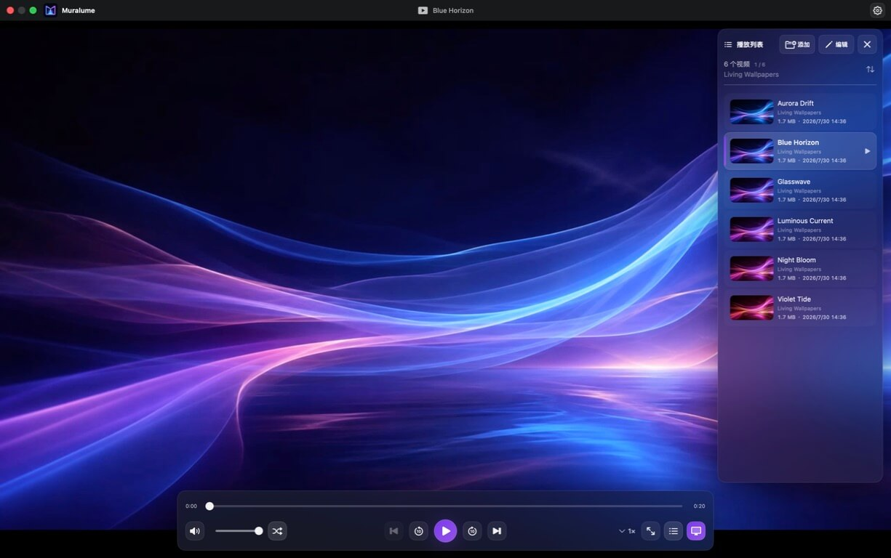

<p align="center">
  
</p>

<h1 align="center">Muralume</h1>

<p align="center"><strong>Your videos. Your Mac. Your desktop in motion.</strong></p>

<p align="center">
  <strong>English</strong> · <a href="README.zh-CN.md">简体中文</a>
</p>

<p align="center">
  <a href="https://github.com/MisakiHCL/Muralume/releases/tag/v0.1.0"><strong>Download v0.1.0</strong></a>
  · Apple silicon · macOS 14+
</p>

<p align="center">
  
</p>

Muralume turns folders of local videos into playlists for a focused native player—and, when you want, a Dynamic Desktop. Your files stay where they are, with no cloud account and no tracking.

## Why Muralume

### Your videos stay yours

Muralume works directly with the folders you choose and accesses them read-only. Source videos are never uploaded, moved, renamed, or deleted. There are no accounts, usage analytics, or automatic crash uploads.

### An energy-aware Dynamic Desktop

Send the current playback queue behind your desktop files and widgets in one click. Dynamic Desktop stays muted, leaves your desktop interactive, does not ask macOS to keep the display awake, and automatically pauses when the screen locks or the display sleeps.

### Folders become playlists

Add one or more folders from your Mac or an external drive. Muralume recursively discovers supported videos, generates thumbnails, and lets you sort by name, creation date, or file size—without reorganizing anything on disk.

### Native playback, without the clutter

Play, seek, adjust volume and speed, use ordered playback or shuffle every item once before reshuffling, and enter fullscreen. Controls move out of the way while you watch, and your playback preferences are restored the next time you open Muralume.

## Download

[Download `Muralume.dmg`](https://github.com/MisakiHCL/Muralume/releases/download/v0.1.0/Muralume.dmg), open it, and drag Muralume into Applications.

The v0.1.0 DMG is signed with a Developer ID certificate and notarized by Apple. Its matching [SHA-256 checksum](https://github.com/MisakiHCL/Muralume/releases/download/v0.1.0/Muralume.dmg.sha256) is published alongside it.

## Quick start

1. Add one or more folders containing videos.
2. Pick a video from the playlist, or sort the list by name, creation date, or size.
3. Use the player controls for seeking, volume, playback speed, fullscreen, and ordered or shuffle playback.
4. Select the display button to move the current queue to your desktop. Use the Muralume menu bar icon to pause, skip, change playback speed or display mode, and return to the player.

Muralume remembers your volume, mute state, playback order, speed, list sorting, and interface language between launches. Choose English or Simplified Chinese, or let Muralume follow macOS.

## Keyboard shortcuts

| Action | Shortcut |
|---|---|
| Add folder | `⌘O` |
| Play / pause | `Space` |
| Back / forward 10 seconds | `←` / `→` |
| Previous / next video | `⌘←` / `⌘→` |
| Volume down / up | `↓` / `↑` |
| Mute / unmute | `M` |
| Enter / exit fullscreen | `F` |
| Open settings | `⌘,` |

## System requirements

- Apple silicon Mac
- macOS 14 or later
- MP4, MOV, or M4V video
- Dynamic Desktop currently uses the primary display

Actual playback compatibility depends on the codecs supported by macOS AVFoundation. H.264 and HEVC are common compatible choices.

## Build from source

Install Xcode with Swift 6 support and [ripgrep](https://github.com/BurntSushi/ripgrep), then run:

```bash
git clone https://github.com/MisakiHCL/Muralume.git
cd Muralume
make test
make package-macos
```

`make package-macos` creates an ad-hoc signed DMG in `dist/macos-local/` for local installation testing only.

## Privacy and open source

Muralume has no account system, cloud upload, product telemetry, or automatic crash reporting. Removing a folder from Muralume never deletes the source videos.

Source code is available under the [MIT License](LICENSE). The Muralume name, logo, app icon, and menu bar icon are excluded from the MIT grant; see the [Brand Assets Notice](BRAND_ASSETS.md).
