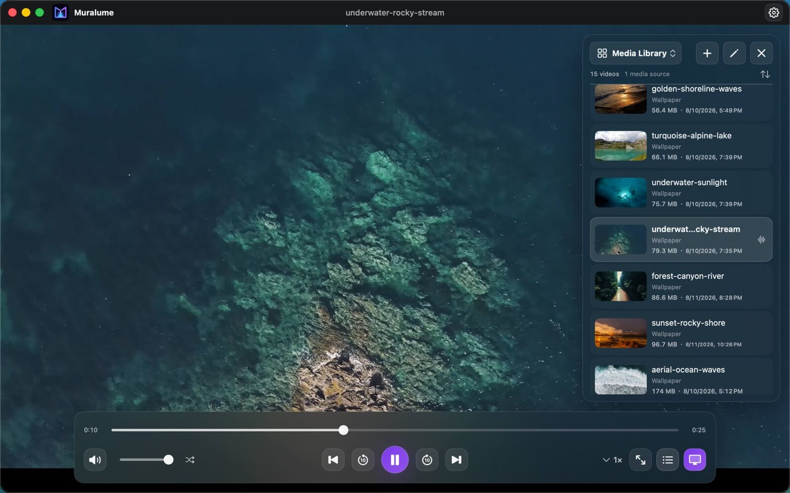

<p align="center">
  
</p>

<h1 align="center">Muralume</h1>

<p align="center"><strong>Your desktop is too big to stand still.</strong></p>

<p align="center">
  <strong>English</strong> · <a href="README.zh-CN.md">简体中文</a>
</p>

<p align="center">
  <a href="https://apps.apple.com/app/id6799577992"><strong>Mac App Store</strong></a>
  ·
  <a href="https://github.com/MisakiHCL/Muralume/releases/latest"><strong>GitHub Release</strong></a>
  <br>
  Free · Apple silicon · macOS 14+
</p>

<p align="center">
  
</p>

Set the videos you love loose across every display. Muralume is a featherlight,
native macOS app that plays behind files and widgets, gives each screen its own
personality, and keeps every frame on your Mac. No accounts. No uploads. No ads.
No tracking. Just a desktop that finally feels alive.

## See it in motion

This short tour shows how a local video becomes a Dynamic Desktop while files,
widgets, and normal desktop interaction remain available.

https://github.com/user-attachments/assets/9a6f92f6-ec13-476c-a863-55134aa03f3a

## Features

- **Your videos. No catalog:** Add individual videos, folders, or both. Muralume keeps
  source files in place and accesses only the items you choose.
- **A library that keeps up:** Browse thumbnails, sort your collection, search by name or
  location, and automatically discover folder changes while the app is open.
- **Playlists, your way:** Create custom groups, add and reorder videos, search
  within a playlist, and continue from the same playlist after relaunch.
- **See exactly what plays next:** Use ordered playback, shuffle, Repeat Current Video,
  seeking, volume, speed, fullscreen, and a separate Play Queue.
- **One Mac. Every display:** Place video behind desktop files and widgets, use one
  synchronized queue across displays, or assign an independent loop to each
  display.
- **Private means private:** Local processing, read-only media access, no account,
  no uploads, no product telemetry, and no automatic crash reporting.
- **Pick up where you left off:** Reopen Muralume to restore the current session; enable
  Launch at Login to restore the Dynamic Desktop after signing in.

## Get started

1. Choose **Add Media…** or drag videos and folders from Finder.
2. Browse or search the Media Library, then play a video or organize it into a
   named playlist.
3. Choose ordered playback, shuffle, or Repeat Current Video from the player.
4. Press `⌘D` to use the current playback collection as a Dynamic Desktop, or
   press `⇧⌘D` to customize displays.

## Download

Muralume is free through both official channels, with the same core features:

- [**Mac App Store**](https://apps.apple.com/app/id6799577992) — install from the
  store and receive updates through the App Store.
- [**GitHub Release**](https://github.com/MisakiHCL/Muralume/releases/latest) —
  [download the notarized `Muralume.dmg`](https://github.com/MisakiHCL/Muralume/releases/latest/download/Muralume.dmg)
  directly. Version notes and checksums are published with each
  [GitHub Release](https://github.com/MisakiHCL/Muralume/releases).

For the GitHub version, open the DMG and drag Muralume into Applications.

## Keyboard shortcuts

| Action | Shortcut |
|---|---|
| Add videos or folders | `⌘O` |
| Search videos | `⌘F` |
| Set as Dynamic Desktop | `⌘D` |
| Customize display layout | `⇧⌘D` |
| Play / pause | `Space` |
| Back / forward 10 seconds | `←` / `→` |
| Previous / next video | `⌘←` / `⌘→` |
| Volume down / up | `↓` / `↑` |
| Mute / unmute | `M` |
| Enter / exit fullscreen | `F` |
| Open settings | `⌘,` |

## System requirements

- Apple silicon Mac
- macOS 14 or later
- A video in an AVFoundation-compatible format, including common MP4, MOV, M4V, MPEG,
  MPEG-TS, 3GP, 3G2, AVI, and DV files

Playback compatibility depends on the codecs available through macOS.

## Build from source

Install Xcode with Swift 6 support and
[ripgrep](https://github.com/BurntSushi/ripgrep), then run:

```bash
git clone https://github.com/MisakiHCL/Muralume.git
cd Muralume
make test
make package-macos
```

`make package-macos` creates a local, ad-hoc signed DMG for development and
installation testing. It is not an official distribution build.

## Open source

Source code is available under the [MIT License](LICENSE). Before contributing,
read [Contributing](CONTRIBUTING.md), the [Security Policy](SECURITY.md), and the
[Community Code of Conduct](CODE_OF_CONDUCT.md). Vendored build components retain
their licenses in [Third-Party Notices](THIRD_PARTY_NOTICES.md). The Muralume
name and visual assets are excluded from the MIT grant; see the
[Brand Assets Notice](BRAND_ASSETS.md).
