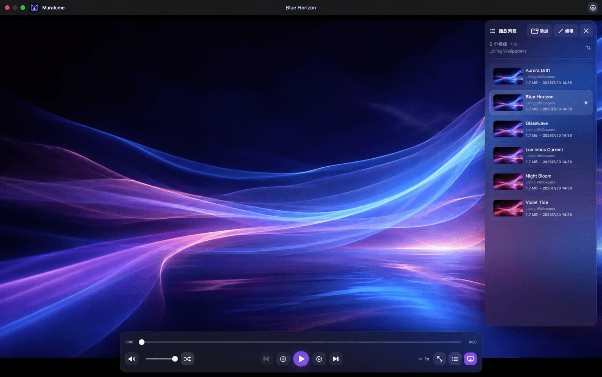

<p align="center">
  
</p>

<h1 align="center">Muralume</h1>

<p align="center"><strong>你的视频，你的 Mac，让桌面动起来。</strong></p>

<p align="center">
  <a href="README.md">English</a> · <strong>简体中文</strong>
</p>

<p align="center">
  <a href="https://github.com/MisakiHCL/Muralume/releases/latest"><strong>下载最新版本</strong></a>
  · Apple 芯片 · macOS 14+
</p>

<p align="center">
  
</p>

Muralume 是一款私密、原生的 macOS 动态桌面应用，把你选择的视频和文件夹变成会动的桌面。内置的本地播放器与播放列表负责预览和编排，全程无需账号、云端上传或行为追踪

## 为什么选择 Muralume

| | |
|---|---|
| **播放你自己的内容** | 宠物片段、旅行记忆、延时摄影，或你已经拥有的生成视频都可以成为桌面 |
| **文件夹就是播放列表** | 添加单个视频、整个文件夹，也可以直接从访达拖入 |
| **桌面仍然属于你** | 画面位于文件和小组件之后，不抢占点击或键盘焦点 |
| **私密且原生** | 只读本地访问、macOS 原生播放，无账号、上传、广告或遥测 |

## 如何使用

1. 使用同一个“添加媒体”选择器选择视频、文件夹或两者，也可以直接从访达拖入
2. 选择顺序播放或随机播放，在内置播放器中预览队列
3. 按下 `⌘D`，把同一队列放到文件和小组件之后，成为动态桌面

## 产品亮点

### 隐私从设计开始

源视频始终保留在原处。Muralume 只会以只读方式访问你主动选择的视频或文件夹，不上传、移动、重命名或删除它们，也不包含账号系统、产品遥测和自动崩溃上报。

### 注重能耗的动态桌面

将当前播放队列置于每块已连接显示器的桌面文件和小组件之后，同时保持各个桌面完整可交互。连接、移除、重新排列显示器或更改分辨率时，播放队列不会重新启动。Muralume 使用 macOS 原生播放能力，桌面模式始终静音，不阻止显示器休眠，并会在锁屏、所有显示器休眠或系统进入受限状态时自动暂停。

默认完整保留清晰画面，并用同帧模糊背景自然填满上下或左右留白

### 视频和文件夹都能成为播放列表

可以从同一个“添加媒体”选择器中选择单个或多个视频、本机或外置磁盘中的文件夹，也可以混合选择或直接从访达拖入。Muralume 会递归发现文件夹中的 MP4、MOV 和 M4V 视频、在本地生成缩略图，并支持按名称、创建时间或文件大小排序，无需重新整理磁盘文件。若文件夹内容在访达中发生变化，可在播放列表中使用“编辑 → 刷新数据”重新扫描已经授权的来源

### 专注的原生播放体验

支持进度跳转、音量、倍速、全屏、顺序播放和随机播放。随机模式会在新一轮开始前完整播放每个可用视频。观看时控件自然隐去，常用的全局播放偏好也会在下次启动时恢复。

退出并重新打开 Muralume 后，会继续恢复同一视频、播放位置、播放或暂停状态，以及上次的播放器或动态桌面呈现。若退出前正在使用动态桌面，应用会直接恢复，不会先短暂打开播放器窗口。

### 登录后即可恢复

你可以让 Muralume 随 macOS 登录启动，并直接把当前队列恢复为动态桌面。启动过程不会打扰桌面，播放控制保留在菜单栏入口中。

## 下载

[下载 `Muralume.dmg`](https://github.com/MisakiHCL/Muralume/releases/latest/download/Muralume.dmg)，打开后将 Muralume 拖入“应用程序”文件夹。

最新发布版提供使用 Developer ID 签名并通过 Apple 公证的 DMG，以及对应的 [SHA-256 校验文件](https://github.com/MisakiHCL/Muralume/releases/latest/download/Muralume.dmg.sha256)

> 本页描述当前 `main` 分支，签名下载版与准确功能范围请查看[最新发布说明](https://github.com/MisakiHCL/Muralume/releases/latest)

## 登录后自动恢复

如需在登录后自动恢复当前队列，请在播放队列有效时打开设置并勾选“登录时启动动态桌面”。macOS 可能会要求你在“登录项”中批准 Muralume

菜单栏入口可以暂停、切换视频、选择顺序或随机播放、调整倍速或桌面适配、返回播放器，以及退出 Muralume。

## 快捷键

| 操作 | 快捷键 |
|---|---|
| 添加视频或文件夹 | `⌘O` |
| 设为动态桌面 | `⌘D` |
| 播放 / 暂停 | `Space` |
| 后退 / 前进 10 秒 | `←` / `→` |
| 上一部 / 下一部 | `⌘←` / `⌘→` |
| 调低 / 调高音量 | `↓` / `↑` |
| 静音 / 取消静音 | `M` |
| 进入 / 退出全屏 | `F` |
| 打开设置 | `⌘,` |

## 系统要求

- 搭载 Apple 芯片的 Mac
- macOS 14 或更高版本
- MP4、MOV 或 M4V 视频
- 所有已连接显示器共享同一视频、播放时钟和显示模式，暂不支持逐显示器独立媒体

实际播放能力取决于 macOS AVFoundation 提供的编解码器；H.264 与 HEVC 是常见的兼容选择。

## 从源码构建

安装支持 Swift 6 的 Xcode 与 [ripgrep](https://github.com/BurntSushi/ripgrep)，然后运行：

```bash
git clone https://github.com/MisakiHCL/Muralume.git
cd Muralume
make test
make package-macos
```

`make package-macos` 会在 `dist/macos-local/` 生成 ad-hoc 签名的 DMG，仅供本机安装验证。

## 开源

源代码使用 [MIT License](LICENSE)。参与项目前请阅读[贡献指南](CONTRIBUTING.md)、[安全政策](SECURITY.md)与[社区行为规范](CODE_OF_CONDUCT.md)。构建工具中随仓库提供的第三方组件保留各自许可，详见[第三方声明](THIRD_PARTY_NOTICES.md)。Muralume 名称、Logo、App Icon 与菜单栏图标不包含在 MIT 授权范围内，详见[品牌资产声明](BRAND_ASSETS.md)。
