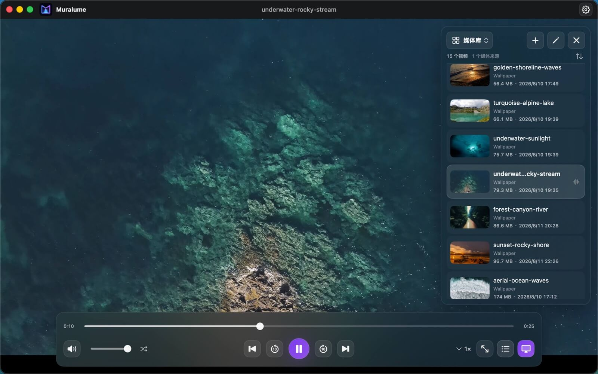

<p align="center">
  
</p>

<h1 align="center">Muralume</h1>

<p align="center"><strong>别让喜欢的影像，只在播放器里出现。</strong></p>

<p align="center">
  <a href="README.md">English</a> · <strong>简体中文</strong>
</p>

<p align="center">
  <a href="https://apps.apple.com/app/id6799577992"><strong>Mac App Store</strong></a>
  ·
  <a href="https://github.com/MisakiHCL/Muralume/releases/latest"><strong>GitHub Release</strong></a>
  <br>
  免费 · Apple 芯片 · macOS 14+
</p>

<p align="center">
  
</p>

Muralume 把宠物、旅途、延时摄影和每一段舍不得关掉的视频，送到每天都在看的
桌面上。它小巧、原生，也足够安静：画面在文件和小组件后方流动，多块屏幕可以
整齐同步，也可以各有性格。视频留在 Mac，隐私也留在你手里。

## 看看实际效果

这段简短演示展示了如何把本地视频设为动态桌面，同时保留桌面文件、小组件与
正常交互。

https://github.com/user-attachments/assets/9a6f92f6-ec13-476c-a863-55134aa03f3a

## 功能

- **你的影像，不是平台的内容：** 添加单个视频、文件夹或两者的组合。源文件始终保留在原处，
  Muralume 只访问你主动选择的内容。
- **会自己跟上变化的媒体库：** 浏览缩略图、排序内容、按名称或位置搜索，并在应用运行期间自动发现
  已授权文件夹中的变化。
- **播放列表由你定义：** 创建自定义分组，添加和排序视频，在播放列表内搜索，并在
  重新打开应用后继续使用上次的播放列表。
- **下一段是什么，一目了然：** 支持顺序播放、随机播放、循环当前视频、进度跳转、音量、
  倍速、全屏，以及独立呈现真实顺序的播放队列。
- **一台 Mac，每块屏幕都精彩：** 将视频放在桌面文件与小组件后方；多块显示器可以同步使用同一队列，
  也可以分别循环不同视频。
- **真正的私密：** 本地处理、只读媒体访问，无账号、上传、产品遥测或自动崩溃上报。
- **离开再回来，精彩继续：** 重新打开 Muralume 后可恢复当前会话；启用“登录时启动”后，也可
  在登录系统时恢复动态桌面。

## 开始使用

1. 选择“添加媒体…”，或从访达拖入视频和文件夹。
2. 浏览或搜索媒体库，直接播放视频，或将其整理到自定义播放列表。
3. 在播放器中选择顺序播放、随机播放或循环当前视频。
4. 按 `⌘D` 将当前播放内容设为动态桌面，或按 `⇧⌘D` 自定义显示器。

## 下载

Muralume 通过两个官方渠道免费提供，核心功能一致：

- [**Mac App Store**](https://apps.apple.com/app/id6799577992)：通过商店安装，
  后续更新由 App Store 管理。
- [**GitHub Release**](https://github.com/MisakiHCL/Muralume/releases/latest)：直接
  [下载经过公证的 `Muralume.dmg`](https://github.com/MisakiHCL/Muralume/releases/latest/download/Muralume.dmg)。
  每个版本的正式说明与校验文件统一发布在
  [GitHub Releases](https://github.com/MisakiHCL/Muralume/releases) 页面。

使用 GitHub 版本时，打开 DMG 后将 Muralume 拖入“应用程序”文件夹即可。

## 快捷键

| 操作 | 快捷键 |
|---|---|
| 添加视频或文件夹 | `⌘O` |
| 搜索视频 | `⌘F` |
| 设为动态桌面 | `⌘D` |
| 自定义显示器布局 | `⇧⌘D` |
| 播放 / 暂停 | `Space` |
| 后退 / 前进 10 秒 | `←` / `→` |
| 上一个视频 / 下一个视频 | `⌘←` / `⌘→` |
| 调低 / 调高音量 | `↓` / `↑` |
| 静音 / 取消静音 | `M` |
| 进入 / 退出全屏 | `F` |
| 打开设置 | `⌘,` |

## 系统要求

- 搭载 Apple 芯片的 Mac
- macOS 14 或更高版本
- AVFoundation 支持的视频格式，包括常见的 MP4、MOV、M4V、MPEG、MPEG-TS、
  3GP、3G2、AVI 和 DV 文件

实际播放能力取决于 macOS 提供的编解码器。

## 从源码构建

安装支持 Swift 6 的 Xcode 与
[ripgrep](https://github.com/BurntSushi/ripgrep)，然后运行：

```bash
git clone https://github.com/MisakiHCL/Muralume.git
cd Muralume
make test
make package-macos
```

`make package-macos` 会生成供开发与本机安装测试使用的 ad-hoc 签名 DMG，
它不是正式分发版本。

## 开源

源代码使用 [MIT License](LICENSE)。参与项目前请阅读[贡献指南](CONTRIBUTING.md)、
[安全政策](SECURITY.md)与[社区行为规范](CODE_OF_CONDUCT.md)。构建工具中随仓库提供的
第三方组件保留各自许可，详见[第三方声明](THIRD_PARTY_NOTICES.md)。Muralume 名称与
视觉资产不包含在 MIT 授权范围内，详见[品牌资产声明](BRAND_ASSETS.md)。
